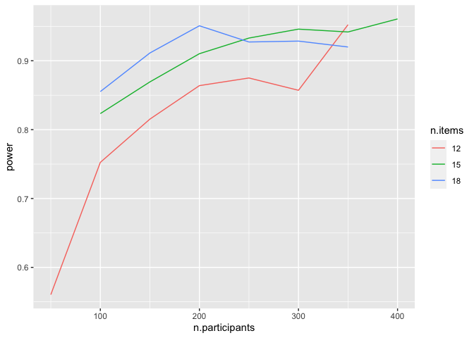

elephants-coord-power-writeup
================
Karen Gu

## Power Analysis for Variable Coordination Experiment

Here we simulated further variable coordination experiments with varying
numbers of items and participants. Code for the simulations is found in
`./elephants-coord-power-analysis.Rmd`. Each simulation is identified by
a seed. We define our goal as having any beta coefficient greater than
0, that is, any coordination level besides S implies higher prevalence
levels than S alone.

``` r
calculate.power <- function(results.folder, file.name) {
  read.csv(paste(results.folder, file.name, sep="/")) %>% filter(is.na(group)) %>% mutate(achieved = conditionnp > 0 | conditionpp > 0 | conditionvp > 0)
}

datalist = list()
i <- 0
for (trial in seq(100, 400, 50)) {
  for (item in seq(12, 18, 3)) {
    if (trial == 400) next
    i <- i + 1
    dat <- calculate.power("./results", paste("elephants-coord-sim-", trial, "-items-", item, ".csv", sep=""))
    datalist[[i]] <- dat
  }
}
for (trial in seq(50, 250, 50)) {
  i <- i + 1
  dat <- calculate.power("./results", paste("elephants-coord-sim-", trial, ".csv", sep="")) %>% mutate(n.items = 12)
  datalist[[i]] <- dat
}
for (trial in seq(100, 450, 50)) {
  for (item in seq(15, 21, 3)) {
    i <- i + 1
    file.name <- paste("./results_2", paste("elephants-coord-sim-", trial, "-items-", item, ".csv", sep=""), sep="/")
    if (file.exists(file.name)) {
      dat <- calculate.power("./results_2", paste("elephants-coord-sim-", trial, "-items-", item, ".csv", sep=""))
      datalist[[i]] <- dat
    }
  }
}

power.data <- bind_rows(datalist)
power.data %>% group_by(n.participants,  n.items) %>% count()
```

    ## # A tibble: 20 x 3
    ## # Groups:   n.participants, n.items [20]
    ##    n.participants n.items     n
    ##             <int>   <dbl> <int>
    ##  1             50      12  1010
    ##  2            100      12  1115
    ##  3            100      15   515
    ##  4            100      18   152
    ##  5            150      12  1115
    ##  6            150      15   482
    ##  7            150      18   124
    ##  8            200      12  1036
    ##  9            200      15   474
    ## 10            200      18   124
    ## 11            250      12   216
    ## 12            250      15   474
    ## 13            250      18    81
    ## 14            300      12   105
    ## 15            300      15   474
    ## 16            300      18    42
    ## 17            350      12   105
    ## 18            350      15   374
    ## 19            350      18    25
    ## 20            400      15   160

``` r
power.data %>% mutate(n.items = factor(n.items)) %>% group_by(n.participants, n.items) %>% summarize(power=mean(achieved)) %>%
  ggplot(aes(x=n.participants, y=power, color=n.items)) +
  geom_line(aes(group=n.items))
```

    ## `summarise()` regrouping output by 'n.participants' (override with `.groups` argument)

<!-- -->
